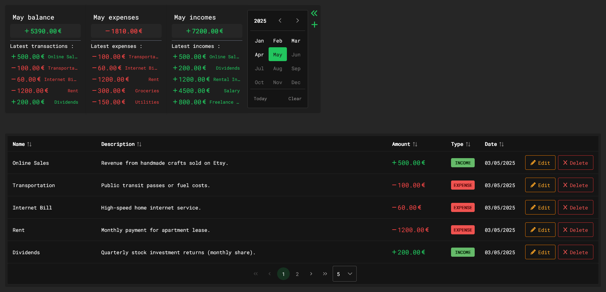

# Expense Tracker

A full-stack learning project to maintain coding skills and explore modern technologies.

## 🛠️ Tech Stack

**Back-end:**
- Java Spring Framework
- Hibernate/JPA
- PostgreSQL

**Front-end:**
- Vue 3
- Pinia (State Management)
- PrimeVue (UI Components)
- Tailwind CSS

## ✨ Features
- Basic CRUD operations implementation
- REST API endpoints
- Responsive UI components
- State management with Pinia



### Installation
1. Clone the repository
   ```bash
   git clone git@github.com:nllko/expense-tracker.git

2. Backend Setup
   ```bash
   cd backend
   mvn clean install
- Create PostgreSQL database `your_db_name`
- Add `db.properties` file inside `back-end/src/main/resources` with params
  ```properties
  spring.datasource.url=url_to_your_db
  spring.datasource.username=your_username
  spring.datasource.password=your_password

3. Frontend Setup
    ```bash
   cd frontend
   npm install
   
### Running

- Backend:
  ```bash
  mvn spring-boot:run
- Front-end: 
  ```bash
  npm run serve

📌 To-Do

- [ ] Add more validation
- [ ] Improve error handling
- [ ] Revisit stores and data fetching 
- [ ] Loading states for stores
- [ ] Tests :D

🤝 Contributing

This is primarily a personal learning project, but suggestions are welcome through issues. Not actively seeking contributions at this time.